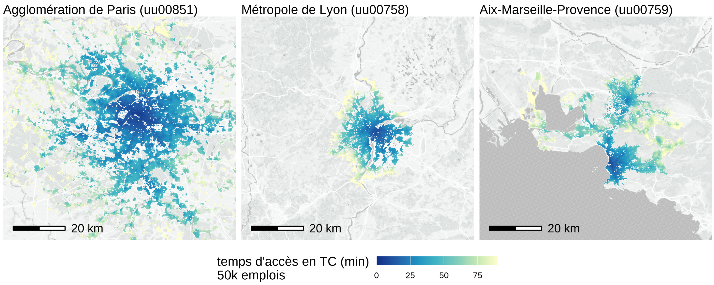
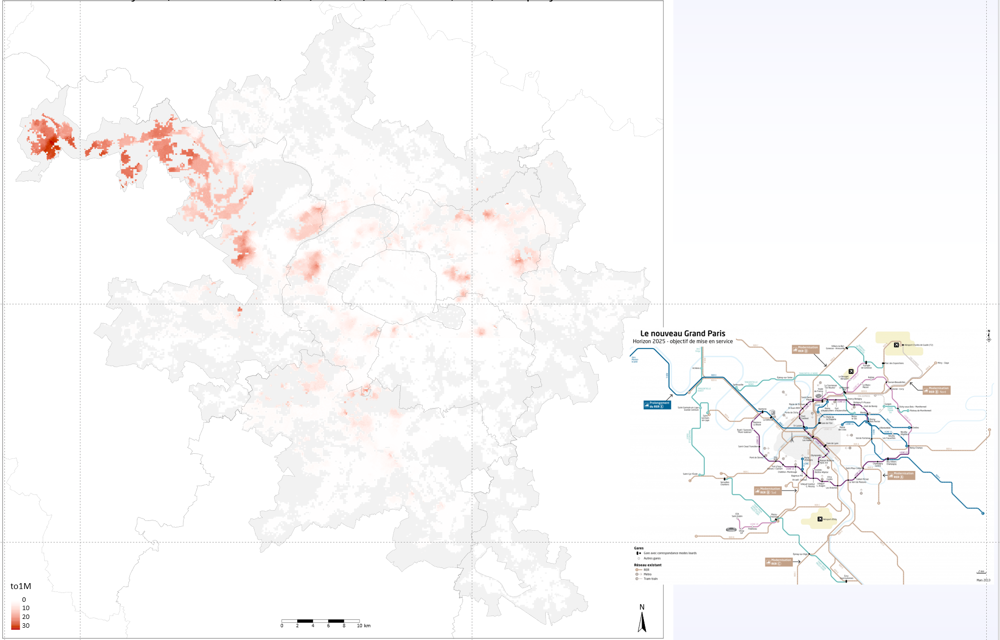
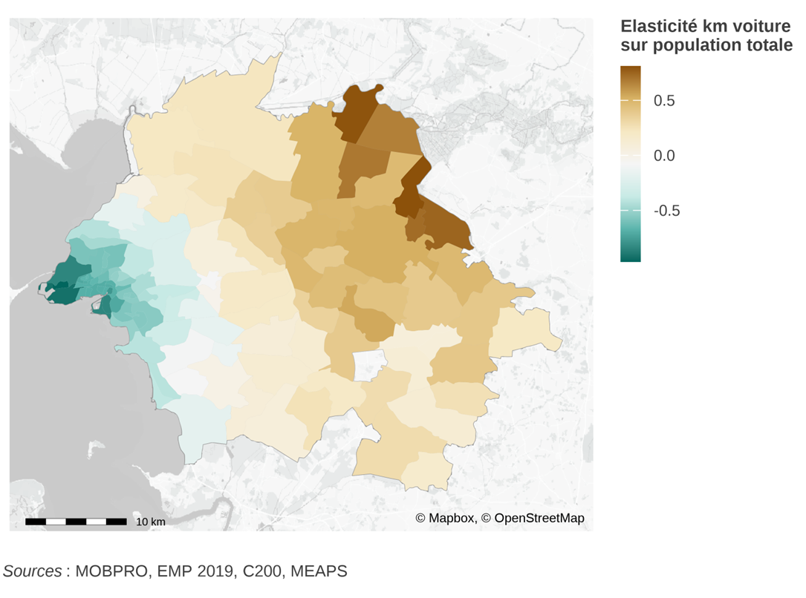
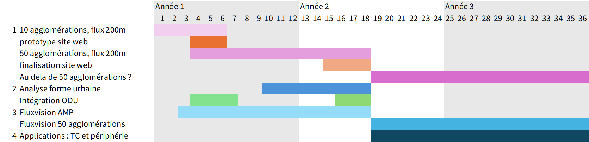

## MEAPS : de l'accessibilité au trajets

L'accessibilité (aux opportunités, cf. @cerema2015) est une notion féconde. Développée après guerre, par @hansen1959 elle est au cœur de l'analyse des réseaux de transports et de la mobilité. En France par exemple, @jeanpoulit2005 et @koenig1980 ont utilisé largement ce concept aux Ponts et Chaussées, dans l'analyse des réseaux routiers.

Nous avons développé une méthode pour calculer l'accessibilité à une échelle géographique fine (carreau INSPIRE 200m\$\times\$200m), pour de nombreuses catégories d'opportunités (emploi, commerces, etc...) et pour différents modes de transport (à pied, en transport en commun, en vélo ou en voiture). La résolution retenue autorise de prendre en compte de nombreuses nuances dans les réseaux de transport ou la localisation des aménités. Cela permet une meilleure compréhension des territoires dès que cette analyse peut être systématisée.

Deux difficultés d'ordre pratiques ont été résolues : l'utilisation d'informations géographiques pertinentes pour la résolution choisie et la volumétrie de calcul impliquée. Par exemple, pour la métropole d'Aix-Marseille-Provence, plus d'un milliard de distances sont calculées entre chaque paire origine-destination. La résolution employée, combinée aux données fines, permet de construire des scénarios pour représenter par exemple l'impact d'un nouveau réseau comme le Grand Paris Express sur l’Île de France.

{fig-align="center" width="510"}

L'accessibilité quantifie un potentiel. Pour aller plus loin, nous avons développé un modèle théorique [@meaps2023] qui est une alternative au modèle gravitaire (et qui affecte des flux en fonction de distances ou de coûts généralisés), en permettant de prendre en compte la double concurrence des individus voisins pour les mêmes opportunités (lorsqu'elles ont une capacité finie) et, réciproquement, la concurrence des opportunités pour les individus (lorsque les opportunités doivent être remplies, e.g. des emplois). Associé à cette modélisation originale, nous avons développé des méthodes d'estimation qui permettent d'ajuster le modèle sur des données comportementales comme l'enquête mobilité des personnes [@meaps2024a].

Ces modèles, qui mobilisent des sources de données disparates de façon cohérente, sont des outils efficaces pour traiter des questions de forme urbaine. Quelles sont les conséquences de la répartition spatiale des emplois et des logements, reliés par des réseaux de transport sur le bilan carbone mobilité d'un territoire ? Comment la densification des logements, le dimensionnement du réseau de transport ou les politiques publiques d'incitation au vélo peuvent modifier ce bilan ? Au delà du bilan carbone, quel est le coût de la mobilité et comment se combine-t-il au coût du logement et au tri spatial des catégories sociales pour analyser les tensions sociales d'un territoire ?

Dans @meaps2024b nous tirons une conclusion importante : la littérature en économie urbaine a conclut, de façon convaincante et robuste, que le lien entre densité et émissions (de tout genre) était positif (ce qui est conforme à l'intuition) mais très faible (ce qui est ennuyeux). Ainsi, pour significativement réduire les émissions (disons de 30%), il faudrait augmenter la densité de population de 300% ce qui paraît impossible à faire tant l'effort individuel ou collectif demandé est considérable. Pourtant, nous arguons que la question est mal posée et donc que la réponse apportée dans la littérature récente [@duranton2020] n'est pas pertinente. La densité n'est pas une notion homogène spatialement et accroître la densité "près" des emplois n'a pas le même impact que plus loin, dès lors qu'on sait définir correctement le proche et le lointain. La prise en compte explicite des co-distributions spatiales des emplois et des logements permet de donner à ces éléments un contenu précis.

Le travail empirique réalisé à la Rochelle permet de quantifier ce contenu, et d'éclairer la conclusion consensuelle sur le lien entre la densité urbaine et les émissions de CO~2~ sous un jour nouveau, au moins à la Rochelle : on peut par une localisation bien choisie de l'accroissement de la densité être plus efficace. Au lieu d'une augmentation de la densité de 300% il suffit d'une augmentation de la densité (moyenne) de 30%, ce qui en fait un obstacle bien plus facile à franchir et permet de renouveler le débat sur la ville compacte.

{fig-align="center" width="617"}

Pourquoi se limiter à la Rochelle ou Marseille ? Comment rendre plus solides les analyses empiriques proposées ? Comment développer les applications ? C'est le sens du projet proposé : le travail théorique et empirique peut être généralisé à de nombreux territoires, il a été appliqué et expérimenté sur quelques exemples : La Rochelle, Clermont-Ferrand et Aix-Marseille-Provence. La généralisation à l'ensemble des agglomérations françaises, voire européennes, est envisageable pour un coût bien inférieur, mais non nul, à l'investissement initial.

## Le projet

L'ambition est donc de :

1.  **produire des éléments les plus robustes possibles sur un ensemble de territoires** – les 50 premières agglomérations françaises dans un premier temps – pour alimenter le débat sur l'aménagement, dans ses dimensions environnementales mais aussi sociales. Ces éléments sont à l'échelle fine du carreau 200m\$\times\$200m, appuyés sur les données du recensement MOBPRO. Ce choix technique est dans la prolongation de l'analyse des flux de mobilités pour la Rochelle ou [Aix-Marseille-Provence](https://xtimbeau.github.io/marseille) – où l'analyse a été étendue du seul motif mobilité professionnelle à l'ensemble des motifs en utilisant l'EMC^2^. Les matrices de flux permettent de générer des cartes d'émissions de CO~2~ imputées aux résidents et sont un bon résumé de la structure des territoires. Le principe est celui de la diffusion en source ouverte d'un certain nombre d'informations, à affiner en fonction des objectifs (de prestations autour de ces concepts, par exemple des simulations à partir du modèle de scénarios, des analyses plus fines des comportements, l'analyse multi-motifs si EMC^2^) et des possibilités de réutilisation des données sources (par exemple, les analyses sociologiques fines demandent l'utilisation de Fidéli, mais limitent les rediffusions).

2.  **analyser les formes urbaines à partir des données produites**. En disposant de cartes CO~2~ fines, agrégées en indicateurs à définir, on peut procéder à une classification des formes urbaines ou procéder par régression et corrélation multivariée avec d'autres variables localisées pour synthétiser l'information géographique sous jacente en une analyse pertinente. Il existe plusieurs exemples de tentatives de ce type, assez peu convaincantes ou opérationnelles au final ; la possibilité d'articuler distribution spatiale des opportunités et des logements ainsi que la capacité à prendre en compte les réseaux de transport devrait faire aboutir ce type de démarche. Cette analyse compléterait les cartes CO~2~ locales par une approche globale et synthétique.\
    Outre les aspects de mobilité et d'accessibilité, à l'image de ce qui a été fait à La Rochelle, en utilisant les informations de revenu au carreau 200m (données publiques) ou les informations issues de Fidéli (à la parcelle, mais avec des contraintes de diffusion), ou encore les informations de prix pour les transactions (DVF/DV3F, données quasi publiques), on analyserait la classification des formes urbaines dans les dimensions sociales (catégories de ménages par revenu, par structure familiale notamment) et économiques (coût complet de résidence incluant le coût du logement et de la mobilité).

3.  **approfondir le travail empirique de recherche avec les données issues de Fluxvision**. L'analyse a été menée jusqu'à maintenant en utilisant MOBPRO comme source de matrice origine destination. La modélisation sert à l'intrapoler à une échelle plus fine (200m\$\times\$200m) que la résolution de MOBPRO (commune/arrondissement à commune/arrondissement) ainsi qu'à l’incorporation des données d'autres sources (les comportements de l'Enquête Mobilité). L'utilisation des données de Fluxvision et plus particulièrement les matrices origines destinations dérivées dans les travaux financés par Transdev sont une piste majeure. Il y est plus difficile d'identifier les motifs ou les catégories sociales des navetteurs, mais les données sont sans doute plus robustes et plus riches parce qu'elles en sont pas déclaratives pour une année, et permettent d'approcher les multi-destinations, les schémas temporels intra-semaine, saisonniers, ou aux périodes particulières.\
    Elles doivent aussi permettre d'évaluer les mobilités difficiles à mesurer comme les itinérants. De plus, les données de *la France Habitée* [@lévy] peuvent permettre de définir une opportunité *synthétique*, alternative à l'approche d'identification directe des opportunités suivies jusque là, qui permettra d'approcher l'attractivité révélée et peut être les aspects de mixité sociale (les lieux visités par des individus venant d'IRIS variés dans leur compositions sociales par exemple). Ce travail à partir des données Fluvision débutera par l'aire urbaine d'Aix-Marseille-Provence pour laquelle de nombreuses analyses ont été réalisées. La disponibilité d'une EMC^2^ récente servira de base à des comparaisons riches d 'enseignement.

4.  **dérouler des applications des modélisations et des transformations des données**. Dans notre démarche, la modélisation sert de cadre pour donner extraire de données riches une information pertinente. Pour en démontrer la pertinence, il faut pouvoir produire des applications. Outre l'analyse des territoires, susceptible par exemple d'influencer l'élaboration des schémas de cohérence territoriale (SCoT), une application pourrait être le *design* des réseaux de transport. Les modèles développés (MEAPS) permettent en effet de projeter ce qui se passerait si une ligne de transport en commun (bus, tram, train) était ajoutée. Sous l'hypothèse (de moyen terme) que les populations ne changent pas, il est possible en effet de partir des comportements observés pour estimer le changement modal qui pourrait être opérer et de produire une évaluation des projections de flux. La méthode tient compte finement des variations de temps de trajet pour chaque mode, des ruptures de charges et d'autres éléments (comme le multimodal). Elle est une alternative à des modèles de transport habituels (à 4 étapes ou LUTI) et, combiné au point 3., elle reposerait sur des données nouvelles. Une piste particulièrement intéressante compte tenu de la granularité spatiale et temporelle des observations Fluxvision est la possibilité de confronter les résultats de la modélisation aux réalisations dans une démarche de quasi expérience naturelle.

## Projets parallèles

Deux projets parallèles à celui-ci valent la peine d'être mentionnés parce qu'ils peuvent compléter les analyses proposées dans le projet.

### Dynamiques urbaines (ODU)

Sur la base des calculs d'accessibilité, et des différents vintages de MOBPRO, on peut analyser les évolutions des mobilités quotidiennes pour la mobilité professionnelle sur des périodes de temps de 10 à 20 ans. Cette comparaison temporelle doit être faite avec soin et elle produit un ensemble de données riches à mettre en rapport avec les formes urbaines (point 2.). Les éléments de cette analyse pourrait être associées à celles ci pour compléter l'offre en source ouverte.

### Difficultés de recrutement

En réponse à un Appel à Projet de Recherche lancé par le PUCA (BEL), nous avons proposé une analyse des difficultés de recrutement issues des données de l'enquête Besoin de Main d’Œuvre et de leur lien avec l'accessibilité à l'emploi. Pour chaque entreprise interrogée (plus de 2 millions chaque année) nous disposons de sa localisation et nous pouvons lui associer une mesure de sa distance à l'emploi, de la quantité d'emplois potentiels accessibles, de la quantité de personnes en recherche d'emploi, du degré de concurrence entre entreprises recherchant des emplois. Sur la base de cette association et de la variance géographique, nous nous proposons de produire une analyse causale entre difficulté de recrutement et structure spatiale des logements ou des résidents et des réseaux de transport.

## Calendrier prospectif et livrables

La première phase du projet est la reproduction des analyses fines de bilan CO~2~ pour un ensemble d'agglomérations. Le délai de production est de l'ordre de 12 mois, un premier livrable (site web présentant les données pour une sous sélection) pouvant être construit d'ici à 6 mois après le lancement du projet. Le lancement du projet pourrait être le 1\^er\^ janvier 2026.

Dans un délai de 12 à 18 mois, l'analyse des formes urbaines pourrait être achevée, publiée sous forme d'un document de travail, et venir augmenter le site web.

L'utilisation des données de Fluxvision serait concentrée dans un premier temps sur l'agglomération d'Aix-Marseille-Provence (AMP). C'est en effet sur ce territoire que notre analyse globale de la mobilité est la plus aboutie. La disponibilité des données EMC^2^ pour la période 2019-2020 est également un plus. En complément, d'autres sources de données seraient employées éventuellement, notamment les données de flotte.

Enfin, la collaboration avec la métropole AMP est possible afin de renforcer le financement du projet. Les livrables seraient des documents de travail présentant (1) la méthodologie ; (2) les enseignements. Les données auraient vocation, sous réserve de possibilité de réutilisation, à être diffusées en source ouverte.

Les autres applications demandent la complétion des étapes 1. et peut être 3. et serait donc conduite entre les mois 18 et 36. Les livrables seraient ici des documents de travail détaillant les méthodologies, les principales conclusions importantes et bien sûr l'alimentation en données du site de diffusion.

## Budget

Le projet est un programme de recherche qui devrait s'étaler sur 3 années. Le coût supplémentaire à financer – additionnels aux coûts de Maxime Parodi et Xavier Timbeau pris en charge par l'OFCE – est composé du coût d'un chercheur additionnel et d'un assistant de recherche pour 3 ans. Un chercheur additionnel représente, suivant le degré de séniorité un coût brut chargé entre 40k€ et 80k€ par an. Un assistant de recherche, parce qu'à temps partiel, coûtent par an 20k€. A cela s'ajoutent un budget réalisation du site web (50k€, pour les 3 ans), un budget informatique de calcul (10k€ par an) et les frais de gestion (10%) hors taxes. Le coût moyen annuel est d'un peu moins de 120k€ (144k€ TTC).

Part un mécanisme similaire à celui d'une chaire, les partenaires financiers pourraient bénéficier d'un crédit d'impôt (à confirmer).

| *en k€*                             | Année 1 | Année 2 | Année 3 |
|-------------------------------------|---------|---------|---------|
| Personnels                          |         |         |         |
|    Chercheur                        | 60      | 60      | 60      |
|    Assistant recherche              | 20      | 20      | 20      |
| Informatique (infra)                |         |         |         |
|    Site web                         | 50      |         |         |
|    Calcul&stockage                  | 10      | 10      | 10      |
| Frais de gestion (10%)              | 14      | 9       | 9       |
| **Total**                           | **154** | **99**  | **99**  |
| *Pour mémoire : coûts imputés OFCE* | 100     | 100     | 100     |

## Propriété intellectuelle & gouvernance

Le financement de ce projet repose a priori sur des conventions de recherche avec différents partenaires.

Les partenaires sont réunis dans un comité de suivi scientifique auquel il est présenté régulièrement (par exemple une fois par an) les travaux réalisés et le programme de travail.

La propriété intellectuelle est celle des co-auteurs. L'ensemble des contributions (code, données) est en source ouverte, à l'exception des droits induits par les données ou logiciels utilisés.

### Références {.unlisted .unnumbered}

::: {#ref}
:::
